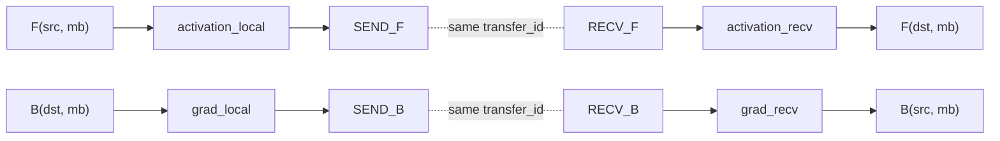

# SchedulePlan 依赖重建与 DES 消费指南

> 目标读者：消费 simulator 输出并负责流水线离散事件仿真（DES）的开发者或 agent。
>
> 本文只说明已经提供了哪些数据，以及如何使用这些数据重建依赖、通信和执行状态。
> 不涉及数据如何捕获，也不要求消费端理解模型框架内部实现。

## 1. 消费端目标

消费端接收每个仿真进程导出的 `SchedulePlan`，重建一次训练 step 的全局执行过程：

1. 每个 rank 按本地计划顺序发布 action。
2. action 只在本地输入就绪后执行。
3. PP SEND/RECV 在不同 rank 间正确配对并只计算一次通信代价。
4. compute action 展开对应 L1 `StepGraph`，得到算子、耗时和静态 tensor 信息。
5. FSDP full parameter 在 UNSHARD 后驻留，在 RESHARD 后释放。
6. event queue 无法继续推进时报告完整死锁原因。

第一版不要求拟合真实 runtime 的纳秒级交叠。正确性标准是：依赖可追溯、通信可配对、所有
action 最终完成、内存状态变化有明确来源，并且不同 PP/DP/FSDP 配置的趋势符合常理。

## 2. 权威输入

消费端的权威入口是：

```text
WorkloadGraph.schedule_plan: SchedulePlan
```

多进程 PP 仿真会为每个仿真进程产生一份 rank-local plan。执行全局 DES 前，应先收集
本次 step 的全部 plan，再统一构建跨 rank communication matcher。

`ir_export/schedule_plan.csv` 是相同结构的可读导出，适合检查和调试。进程内集成应优先直接使用
`SchedulePlan` 对象，避免重新解析 CSV 中的列表和 annotation 字符串。

消费端需要读取四类对象：

| 对象 | 用途 |
|---|---|
| `SchedulePlan.actions` | rank-local action 及发布顺序 |
| `SchedulePlan.data_slots` | 本地 producer/consumer readiness 依赖 |
| `ScheduleAction.comm` | 通信角色、通信量、group 和跨 rank 配对键 |
| `SchedulePlan.step_templates` | compute action 对应的 L1/L0 算子模板 |

若同时重建显存，静态基线和已生成的内存信息位于：

```text
WorkloadGraph.iteration.schedule.annotations["memory_plan"]
```

其中 `MemoryPlan.persistent_param_bytes` 是当前 rank 的持久参数基线。它不属于 action 依赖，
应在 step 开始前加入显存状态。

### 2.1 Rank-local plan 与逻辑 rank

仿真进程数可能只等于 PP degree，而 `SchedulePlan.annotations["rank_table"]` 描述的是完整模拟
world。此时一份 stage plan 是具有相同 PP 坐标的逻辑 rank 的执行模板，不代表完整 world 只有
这些进程。

如果上层 DES 需要展开完整 logical world：

1. 从 RankTable 的 `rank_coordinates` 找到 `pp == action.stage` 的所有逻辑 rank。
2. 为每个逻辑 rank 克隆该 stage 的 action 和 DataSlot instance。
3. 克隆后的 ID 必须带逻辑 rank 命名空间，例如 `g17:r1_a4`、`g17:r1_slot_8`。
4. 重写每个 clone 内部的 producer/consumer/consumes/produces 引用。
5. collective 选择 `comm_group_ranks` 中包含当前逻辑 rank 的 group。
6. PP P2P 在相同非 PP mesh lane 内连接相邻 stage。

同一个 stage-level `transfer_id` 克隆到多个 DP/TP/CP lane 后不能继续作为唯一全局键。建议使用：

```text
logical_transfer_key = (
    base_transfer_id,
    coordinates_except_pp,
)
```

或显式使用 `(base_transfer_id, src_logical_rank, dst_logical_rank)`。src/dst logical rank 应具有
相同的非 PP 坐标，仅 PP 坐标分别等于 `src_stage/dst_stage`。

如果上层只做“每个 PP stage 一个代表 rank”的简化仿真，则不进行 logical-world clone，直接使用
原始 `transfer_id` 即可。两种模式必须显式选择，不能在同一次 DES 中混用。

## 3. 三种关系必须分开处理

这是消费端最重要的规则。不要把下面三种关系合并成一条普通 DAG 边。

### 3.1 Rank-local 发布顺序

同一 plan 内按 `ScheduleAction.schedule_order` 排序。它表示该 rank 的 action 发布顺序。

发布顺序不等于数据依赖。不要为每两个相邻 action 自动创建 DataSlot，否则会错误串行化异步
SEND/RECV 和允许重叠的通信。

### 3.2 本地数据依赖

`DataSlot` 表示本地 tensor 或零字节 readiness token：

```text
producer_action_id -> DataSlot -> consumer_action_ids[]
```

只有 slot producer 完成，slot 才 ready。consumer 的全部 `consumes` slot ready 后，consumer
才满足本地执行条件。

### 3.3 跨 rank 通信配对

PP SEND/RECV 使用：

```text
ScheduleAction.comm.transfer_id
```

进行配对。SEND 与 RECV 之间不创建普通 DataSlot。RECV 可以先发布并等待远端 SEND；如果把
RECV 设置为必须先消费 SEND 的 slot，1F1B 很容易产生人为死锁。



## 4. 数据结构语义

### 4.1 SchedulePlan

消费端需要使用的主要字段：

```text
actions                 rank-local action 列表
data_slots              slot_id -> DataSlot
step_templates          template_ref -> StepGraph
pp_degree               PP stage 数
tp_degree, dp_degree    并行规模元数据
num_micro_batches       当前 step 的 microbatch 数
pipeline_schedule       调度类型
annotations             RankTable、assembler 类型等附加信息
```

`plan_id` 只用于标识输出，不参与依赖匹配。

### 4.2 ScheduleAction

关键字段：

```text
action_id
rank, stage, mb_idx
action_type
comp_type
template_ref
schedule_order
consumes[]
produces[]
is_noop
comm
sub_actions
```

`seq_idx` 是捕获位置和诊断信息。DES 的 rank-local 发布顺序优先使用 `schedule_order`，不能用
不同进程各自的 `seq_idx` 构造全局时间顺序。

### 4.3 DataSlot

关键字段：

```text
slot_id
kind
producer_action_id
consumer_action_ids[]
shape, dtype, volume_bytes
src_stage, dst_stage, mb_idx
external
```

常见 kind：

| kind | 含义 | ready 时机 |
|---|---|---|
| `dataloader_input` | stage 0 输入 | step 开始时 |
| `loss_grad` | 最后 stage 的 loss 梯度 | step 开始时 |
| `activation_local` | F 输出给 SEND_F | producer F 完成 |
| `activation_recv` | RECV_F 收到的激活 | P2P transfer 完成 |
| `grad_local` | B 输出给 SEND_B 或梯度通信 | producer B 完成 |
| `grad_recv` | RECV_B 收到的输入梯度 | P2P transfer 完成 |
| `forward_state` | 同 microbatch 的 F -> B 控制关系 | F 完成 |
| `param_full` | all-gather 后的完整参数 | UNSHARD 完成 |
| `control` | 零字节完成条件 | producer 完成 |
| `grad_reduced` | DP/FSDP 梯度规约结果 | REDUCE_GRAD 完成 |

`external=True` 的 slot 没有内部 producer，初始化时直接加入 ready set。其他被消费的 slot 必须
存在有效 `producer_action_id`，禁止将 producer 为空的内部 slot 当作 ready。

### 4.4 CommDetail

关键字段：

```text
primitive
role                  send | recv | collective
volume_bytes
src_stage, dst_stage, mb_idx
peer_rank
comm_group_ranks
comm_op_id
transfer_id
is_noop
```

`transfer_id` 是 rank-local plan 之间的 PP SEND/RECV 权威配对键。不要用 action id、slot id、
`comm_op_id`、本地 `seq_idx` 或仿真进程 rank 代替它。展开完整 logical world 后，应按 2.1 节
增加非 PP lane 命名空间。

`comm_op_id` 用于查找 L0 通信模板及 cost 信息，不保证跨 rank 相同，也不承担 rendezvous 身份。

## 5. 初始化全局执行状态

收集全部 rank-local plan 后，按以下步骤初始化。

### 5.1 规范化 action

1. 递归展开 `sub_actions`，但保留父 action 的 overlap/group 信息。
2. 为每个 plan 建立 `action_id -> action` 索引。
3. 按 `schedule_order` 建立每个 rank 的 issue queue。
4. 建立全局 `slot_id -> DataSlot` 索引。
5. 将所有 `external=True` slot 标记为 ready。

第一版 1F1B 通常只有 F/B compute，不依赖 overlap。未来消费 DualPipe 等计划时才需要为
`OVERLAP_F_B` 分配并发资源。

### 5.2 建立本地 producer/consumer 索引

对每个 slot：

```text
producer = action_map[slot.producer_action_id]
for consumer_id in slot.consumer_action_ids:
    add local dependency producer -> consumer
```

同时验证双向引用：

- `slot_id` 在 producer 的 `produces` 中；
- `slot_id` 在每个 consumer 的 `consumes` 中；
- 非 external consumed slot 只有一个 producer；
- action 引用的每个 slot 都真实存在。

### 5.3 建立 P2P matcher

遍历所有 `SEND_F/RECV_F/SEND_B/RECV_B`。代表 rank 模式使用 `transfer_id`；完整 logical-world
模式使用 2.1 节的 `logical_transfer_key`：

```text
transfers[transfer_id].send = send_action
transfers[transfer_id].recv = recv_action
```

每个 required `transfer_id` 必须恰好有一个 SEND 和一个 RECV。缺失、多发或重复角色都应在
DES 启动前报错。

一个 transfer 只创建一次网络事件和一次通信代价。SEND/RECV 是该共享事件的两个 endpoint，
不能各计算一次完整通信时间。

collective 不使用 P2P `transfer_id`。应按以下信息建立一次 collective instance：

```text
primitive
normalized comm_group_ranks
stage, mb_idx
action schedule position
fsdp_group_id（若存在）
```

同一 collective group 的所有 logical-rank endpoint 共同等待一个 collective event。通信 cost
仍只由该共享 event 计算，不能每个 endpoint 各执行一次完整 collective。

## 6. Action 执行语义

| action_type | 发布条件 | 完成条件 | 完成后行为 |
|---|---|---|---|
| `COMPUTE` | 全部 consumed slots ready | L1 template 执行完成 | 发布 produced slots |
| `SEND_F/SEND_B` | 本地输入 slot ready | 匹配的 P2P transfer 完成 | endpoint 完成 |
| `RECV_F/RECV_B` | issue cursor 到达即可发布 | 匹配的 P2P transfer 完成 | 发布 recv output slot |
| `UNSHARD` | 本地依赖 ready | all-gather 完成 | 发布 `param_full` |
| `RESHARD` | control slot ready | 本地释放完成 | 结束 `param_full` residency |
| `REDUCE_GRAD` | 本地 gradient slot ready | collective 完成 | 发布 `grad_reduced` |
| `OPTIMIZER` | 所有 gradient slot ready | optimizer template 完成 | step optimizer 阶段完成 |
| `is_noop=True` | issue cursor 到达 | 立即完成 | 不等待通信，不发布阻塞 slot |

特别注意：

- `RESHARD` 是本地 full parameter 释放，不是 reduce-scatter。
- reduce-scatter/all-reduce 属于 `REDUCE_GRAD`。
- real `RESHARD` 通常消费上一 compute 产生的零字节 `control` slot。
- no-op action 不应包含 blocking `consumes/produces`。

FSDP action 的 `annotations` 还提供：

```text
fsdp_group_id
parent_compute_instance_id
residency_comp_type
residency_bytes
```

消费端以 `(logical_rank, stage, fsdp_group_id)` 标识 active full-parameter residency。同 group 的
UNSHARD 打开 residency，后续 RESHARD 关闭它。不要依赖 `comm_op_id` 判断 residency 身份，因为
MB1+ 可以复用 MB0 的同一个通信模板。

## 7. Compute 模板展开

对 `COMPUTE` action：

```text
template = plan.step_templates[action.template_ref]
```

每次 action 执行都创建独立的 template instance。不同 microbatch 可以复用同一 `StepGraph`，
但运行状态、开始结束时间和非持久 tensor 生命周期必须独立。

`StepGraph` 内部的 `OpNode.predecessors/successors` 是 L0 算子依赖。消费端可选择：

1. 将整个 StepGraph 作为一个 compute event，用 cost model 聚合耗时；或
2. 展开全部 L0 OpNode，按其内部 DAG 调度。

两种方式都不能把不同 microbatch 的非持久 tensor 实例合并。`template_ref` 相同只表示结构
复用，不表示 tensor residency 复用。

通信 action 的 L0 节点可通过：

```text
plan.find_op_node(action.comm_op_id)
```

查询。MB1+ 可能复用 MB0 的通信模板，这是预期行为；action instance 和通信事件仍必须独立。

## 8. 最小 DES 状态机

推荐状态：

```text
NOT_ISSUED -> POSTED -> RUNNING/WAITING_COMM -> DONE
```

全局状态至少包括：

```text
rank_cursor[rank]
action_state[action_id]
ready_slots
posted_transfers[transfer_id]
event_queue
resource_state
active_param_residency
```

最小推进伪代码：

```text
initialize external slots as ready

while unfinished actions exist:
    for each rank:
        action = next action at rank_cursor

        if action is RECV:
            post recv endpoint
            advance cursor

        else if all action.consumes are ready:
            if action is SEND:
                post send endpoint
                advance cursor
            else if action is noop:
                complete immediately
                advance cursor
            else:
                schedule compute/local/collective event

    for each transfer with both SEND and RECV posted:
        schedule exactly one network event

    pop earliest event:
        complete its action or transfer endpoints
        publish produced slots
        release last-consumed temporary slots
        advance synchronous action cursor

    if no action can post and event_queue is empty:
        report deadlock and fail
```

第一版建议只允许 P2P endpoint 在 POSTED 后提前推进 cursor；普通 compute、optimizer、RESHARD
及无法确认异步语义的 collective 在 DONE 后再推进。后续若增加明确 launch/wait action，再放宽
UNSHARD 或 gradient collective 的异步重叠。

## 9. 1F1B 必须形成的依赖

对每个本地 `(stage, mb)`：

```text
F(stage, mb) -> forward_state -> B(stage, mb)
```

PP stage 边界：

```text
非首 stage: RECV_F(mb) -> activation_recv -> F(mb)
非末 stage: F(mb) -> activation_local -> SEND_F(mb)

非末 stage: RECV_B(mb) -> grad_recv -> B(mb)
非首 stage: B(mb) -> grad_local -> SEND_B(mb)
```

外部边界：

```text
stage 0:       dataloader_input -> F
last stage:    loss_grad -> B
```

FSDP 与 optimizer：

```text
UNSHARD -> param_full -> F/B
last parameter consumer -> control -> RESHARD
last relevant B -> grad_local -> REDUCE_GRAD -> grad_reduced -> OPTIMIZER
```

没有 DP gradient collective 时，OPTIMIZER 直接消费本地 B 产生的 gradient readiness。

## 10. 内存生命周期的消费规则

依赖重建后可同时驱动静态显存状态：

1. 从 `MemoryPlan.persistent_param_bytes` 读取 step 开始前已存在的静态基线；若消费端自行估算，
   也必须将该值作为 action 之外的 rank-local 常驻状态。
2. 普通 DataSlot 在 producer 完成时出生。
3. 为保证安全，普通 slot 在最后一个 consumer 完成后释放。
4. `param_full` 在 UNSHARD 完成后增加，在匹配 RESHARD 完成后释放。
5. `control`、`forward_state` 等零字节 slot 只影响 readiness，不增加显存。
6. SEND/RECV 两侧 slot 是不同设备上的两个 residency，不能合并成一个本地 tensor。
7. 通信网络代价只计一次，但发送缓冲和接收缓冲可分别计入各自 rank 的显存。

第一版不模拟 allocator fragmentation，也不需要还原未捕获的算子中间激活。只计算 persistent
静态值、L1 模板的输入输出、DataSlot 和 FSDP full parameter residency。

## 11. 校验与死锁诊断

仓库已提供三项结构校验，可作为消费端实现的参考或前置检查：

```text
validate_schedule_plan(plan, strict_1f1b=True)
validate_1f1b_transfer_pairs(all_rank_plans)
replay_1f1b_readiness(all_rank_plans)
```

`replay_1f1b_readiness` 使用零时长 action，证明结构依赖能够推进；它不是带 cost 和资源竞争的
最终 DES。

当最终 DES 无法推进时，至少输出：

```text
每个 rank 的 cursor 和 next action
next action 缺少的 slot ids
每个缺失 slot 的 expected producer 及其状态
已发布但未配对的 transfer_ids
仍 active 的 FSDP group/residency
正在占用 compute/communication resource 的事件
event_queue 内容
```

禁止通过以下方式绕过死锁：

- 将 producer 为空的内部 slot 自动标 ready；
- 跳过找不到 producer 的 consumer；
- 将未配对 RECV 自动完成；
- 将缺失通信的 UNSHARD 自动改成 no-op；
- 在 event queue 为空时把剩余 action 批量标为完成。

## 12. 常见错误

### 错误一：把 schedule_order 变成全依赖链

后果：异步通信全部串行，流水趋势和峰值位置失真。

正确做法：schedule_order 只控制发布；阻塞由 `consumes` 和资源状态决定。

### 错误二：创建 SEND -> RECV 的普通 slot

后果：RECV 不能提前发布，部分 1F1B 顺序发生人为死锁。

正确做法：两端通过 `transfer_id` rendezvous。

### 错误三：SEND 和 RECV 各计算一次通信

后果：网络时间和流量翻倍。

正确做法：一个 transfer_id 对应一个共享网络事件。

### 错误四：把 reduce-scatter 当 RESHARD

后果：参数释放和梯度通信生命周期混淆。

正确做法：RESHARD 本地释放；reduce-scatter 属于 REDUCE_GRAD。

### 错误五：按模板合并 microbatch 状态

后果：多个 microbatch 的 activation 和 P2P residency 被错误复用。

正确做法：模板可复用，action/tensor/event instance 必须独立。

### 错误六：假设 process rank 等于完整逻辑 global rank

后果：PP 进程数小于模拟 world size 时，DP/TP/FSDP group 被错误展开。

正确做法：先按 RankTable 克隆 logical rank；PP 配对使用带非 PP lane 的 logical transfer key，
collective 使用当前 logical rank 所属的 `comm_group_ranks`。

## 13. 完成标准

一次 step 只有同时满足以下条件才算完成：

- 所有 rank cursor 到达队尾；
- 所有非 no-op action 为 DONE；
- 所有 required P2P transfer 已唯一配对并完成；
- 所有内部 consumed slot 都可追溯到 producer；
- 所有非跨迭代 FSDP full-parameter residency 已关闭；
- optimizer action 已完成；
- event queue 和 waiting transfer 集合为空。

建议最终输出：

```text
actions by rank/stage/type
slots by kind
paired and unmatched transfer summary
FSDP residency intervals
action state counts
step completion time
per-rank peak memory and peak action
```

达到以上标准后，上层 DES 才是 `SchedulePlan` 的完整消费者，而不是仅按 CSV 行顺序播放动作。
