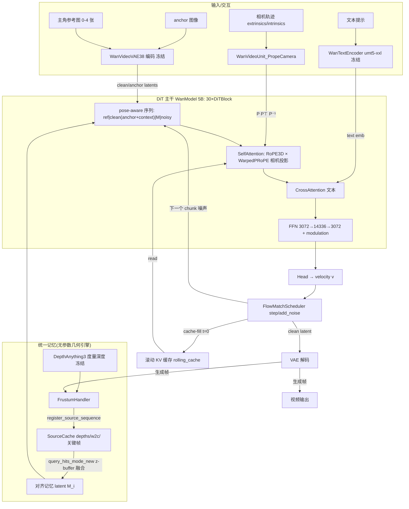
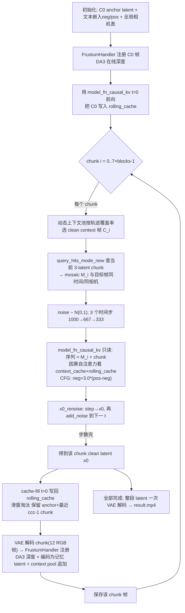
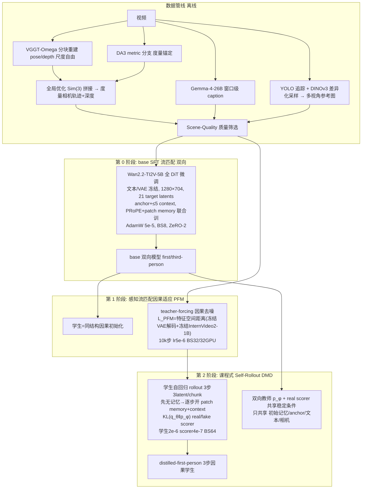

## 0. 代码定位 
model.py 用下述注释定位
PART 1 -- DiT diffusion backbone (mirrors wan_video_dit.py WanModel layout)
PART 2 -- 3D causal video VAE encoder/decoder (mirrors wan_video_vae.py)
PART 3 -- text encoder (umt5/T5-style; mirrors wan_video_text_encoder.py)
PART 4 -- camera-aware attention (Warped PRoPE). Parameter-free geometry.
PART 5 -- DA3 Depth-Anything-3 component (parameterised mirror of
PART 5b -- DA3 DPT heads + DepthAnything3Net / NestedDepthAnything3Net mirror.
PART 5c -- DA3 any-view accessories mirror: CameraEnc / CameraDec / GSDPT /
PART 6 -- flow-match scheduler, losses, real-time interactive engines and the
PART 7 -- configuration registry (open-source-identical + larger presets),
PART 8 -- CLI entry: CPU smoke tests (train / interactive seq / async3 /

## 1. 模型架构图

### 1.1 组件级架构图（ASCII）

```
                        ┌──────────────────────────────────────────────────────┐
   用户交互：文本提示(c)   │                 Matrix-Game-3.5 实时推理回路           │
   相机轨迹(每帧K,W)     │                                                      │
   anchor 图像/首帧     ▼                                                      │
┌──────────────┐  ┌──────────────────┐     ┌───────────────────────────────┐   │
│ WanTextEncoder│  │ WanVideoVAE38(冻结)│     │      FrustumHandler(无参数)     │   │
│ (umt5-xxl 冻结)│  │ encode:RGB→48ch   │     │ register_source_sequence(历史帧, │   │
└──────┬───────┘  │ decode:48ch→RGB    │     │   深度,内参,外参)               │   │
       │4096d     └────────┬──────────┘     │ query_hits_mode_new(目标相机)    │   │
       │                  │latent           │   → 覆盖度选帧/重投影/z-buffer/    │   │
       ▼                  ▼                 │     NMS/融合 → 对齐记忆画布 M      │   │
  text emb ◄── DiT 主干 WanModel (~5B, 唯一可训练) ──► patch/latent 序列 ◄───────┘   │
  (cross-attn)            │                ▲                                  │
       ▲                  │ self-attn: RoPE(3D时空) × Warped PRoPE(P,P⊤,P⁻¹)  │   │
       │                  │  每帧: (subject-ref)┃clean(ctx/anchor)┃M(mosaic)┃noisy │
       │                  │                                    (causal mask 仅蒸馏) │
       │                  ▼                                                │   │
       │           velocity v ── FlowMatchScheduler.step (Euler) ──► x₀ latent ──┼─► VAE decode
       │                                                                        │   → 视频帧
       └──────────── text(外部 Qwen/Gemma 按需改 prompt，外围)                  ▼
       几何条件：DA3 DepthAnything3(冻结,度量深度) ── 供 FrustumHandler 提升 patch 到3D
```

### 1.2 组件级架构图（mermaid）



### 1.3 单卡实时交互推理流程（distilled 3 步因果，真参数见 §4）



### 1.4 训练流程图（SFT 流匹配 + 两阶段蒸馏）



文字说明：三个阶段的训练目标公式见 §5；第 0 阶段产出的双向模型同时充当 DMD 的教师分布 `p_φ`；学生记忆在线自回归更新、scorer 记忆固定，形成 "condition curriculum"（先蒸馏 CFG 与相机控制、后引入 patch memory/context）。

---

## 2. 实时交互推理范式（按代码真参数）

### 2.1 参数总表（来源：`distilled_config.py`、`configs/infer_distilled.yaml`、`causal_config.py`、`causal_rollout.py`）

| 参数 | 值 | 代码位置 |
|---|---|---|
| 分辨率 | 704×1280（latent 44×80，patch 网格 22×40） | `distilled_config.py:17-18` |
| `latent_window_size` | **21**（每窗口 21 latent 帧 = 7 chunks×3；1 anchor + 7×3=22 个 latent 位置） | `distilled_config.py:23`；`causal_config.py:50` |
| `chunk_size` | **3** latent 帧/chunk（=12 RGB 帧） | `distilled_config.py:25`；`causal_rollout.py:332` |
| `context_chunks` | **7**（滑窗保留 [advancing anchor + 最近 7-1 chunk]） | `distilled_config.py:26`；`causal_rollout.py:338/2166-2171` |
| `vae_context_blocks` | **2**（`vae_clean_context_blocks_max=2`，含 `vae_clean_context_mode_ratio 2:8`） | `distilled_config.py:24`；`causal_config.py:51-52` |
| `num_blocks`（块） | 默认 1；`infer_distilled_6blocks.yaml`=6。每块=80 帧输出、84 相机位（README p145 / infer.py 头注释） | — |
| 去噪 schedule | **`(1000, 667, 333)`**（3 步；`causal_dmd_denoising_step_list` 必须从 1000 严格递减）；`prepare_causal_dmd_eval_scheduler` 用 `timestep_wrap` 把整数 id 经 `index=1000−id` 映射到 1000 条 Wan 网格表取 (timestep,sigma)，运行日志打印 "effective 3-step contract"，实际 t/σ 由网格与 shift 决定 | `distilled_config.py:21`；`causal_schedule.py:12-44/106`；`causal_rollout.py:934-948` |
| 学生 CFG | **3.0**（发布文档明确：学生用 CFG3 蒸馏、推理须 CFG3，每步跑 cond+uncond 两支并合并） | `distilled_config.py:34`；`DISTILLED_INFERENCE.md:35-39`；`causal_rollout.py:2083` |
| `memory_mode` | `c0_plus_generated`（C0 + 生成的在线记忆库） | `distilled_config.py:28`；`causal_config.py:99` |
| `memory_publish_interval` | 1（每 chunk 生成完立即发布） | `distilled_config.py:29` |
| context 选择 | `per_3latentframe`；dynamic_context=True（pose 池大小 5、偏好最老）、`dynamic_context_selection: oldest` | `distilled_config.py:27/30-34` |
| mosaic 查询 | `selection_mode=projection_iou`；NMS=coverage；iou 阈 0.7；pose 阈 0.25；pool 倍率 2.5；coverage stride 2；`query_reference_frame=4`；`fuse_mode=fill_stop_zbuffer`；`mosaic_drop_holes=false`（hole 不 drop 但进注意力时被 keep-mask 剔除） | `distilled_config.py:43-52`；`causal_rollout.py:1374-1536` |
| 在线深度 | DA3 `process_res=448`、autocast bf16（`da3_process_res/da3_autocast_dtype`）；注册 RGB 源=generated、深度源=online | `distilled_config.py:53-54`；`causal_config.py:119-120/137-138` |
| 平移压缩 | `trans_scale=logd4`（方向保持、模长 log1p/4） | `distilled_config.py:42`；`wan_video.py:3187-3221` |
| VAE tiled | `vae_decode_tiled`（distilled=false → 整图一次 decode） | `causal_config.py:82` |

### 2.2 一次 chunk 的精确执行（`causal_rollout.py:1307-2160`）

1. **只读 KV 组装**：`read_cache = [C_i(context) | rolling_cache]`；`M_i` 置于 chunk 头部（`mosaic_tokens`），每个 mosaic token 的时间/相机位置**等于**它支持的目标 latent 帧（"addressed by where it should appear"）；hole token（全零 patch）被清零、频率/timestep 置 1000，并在 `causal_self_attention_kv`（`wan_video_dit.py:350`）中通过 `hole_keep` keep-mask 从 noisy chunk 的 key 里剔除。
2. **每步前向**：`model_fn_causal_kv`（`wan_video.py:3344`）→ `dit.patchify` → 逐 block `causal_self_attention_kv`：
   - cache 中的 k 存的是 **pre-RoPE** k、v 存 raw v，读取时按当前窗口的 RoPE 频率重旋转、再按帧索引用 PRoPE（`prope_attention_by_frame_indices`，`wan_video_dit.py:77`）；
   - 逻辑顺序 `[cache(C0+N<chunk) | M | CUR]`；CUR 只能看 cache+M+自己；context 条目带 `chunk_ids`，`cache_read_chunk_id` 过滤 → 只有本 chunk 的 C_i 与全局 anchor 可见（`build_cur_chunk_keep_mask`，`wan_video_dit.py:406-438`）；
   - mosaic 冻结（DiTBlock 前向结束后把 M 复原，`wan_video_dit.py:654-681`）。
3. **3 步采样**：初噪 `torch.randn`；每步 `v = pred`（CFG=3 时把 [neg,pos] 两分支合并），`_causal_dmd_validation_transition`（`causal_rollout.py:268`）执行 **x0_renoise**：`x0 = scheduler.step(v,t,x,to_final=True)`（Euler 到 σ=0），若非末步再 `add_noise(x0, fresh_noise, t_next)`（`causal_rollout.py:2091-2118`）。
4. **cache-fill**：用干净的 chunk 结果 + mosaic，以 t=0 再前向一次 `write_cache=True`，把该 chunk 追加进 rolling_cache，然后 `_causal_kv_trim_rolling_window` 按 `window_chunks=ccc(7)` 滑窗（`causal_rollout.py:2160-2181`）。
5. **记忆发布与 DA3 时机**：凡有"未来消费者"的 chunk，`_decode_generated_chunk_from_prefix_latents`（VAE 解码 12 RGB 帧）→ `handler.register_source_sequence`（内部 `reestimate_depth` 把 DA3 挪上 GPU、`inference(use_ray_pose=True, process_res=448)` 后挪回 CPU，`frustum_handler.py:707-727`）→ 帧再 VAE 编码成 (C,12..,44,80) 查询 latent、记 `source_timeline_positions` 全局时间戳（供 nonlocal/nonlocal_oldest 过滤），并 `add_generated_chunk` 进 dynamic context pool（`causal_memory.py:771`）。
6. 多 block 时整段 7×blocks 个 chunk 顺序执行，块间无缝（滑窗 + 全局位置）。

### 2.3 "clean anchor + noised prefix" 两种 profile

`profile_runtime_settings`（`distilled_config.py:140-146`）翻译成 rollout 策略：
- `standard`（默认，release 推理）：`prefix_noise_mode=none` → rolling prefix 全部以 **t=0 干净 latent** 进 cache；anchor 推进（非固定初始 anchor）。
- `hiar-sde`：每去噪子步把滚动前缀/动态上下文按**下一时间步**再噪声化（`_hiar_sde_corrupt` / `hiar_sde_corrupt_clean_latents`，保留首个 anchor 帧干净，corruption_scale 可逐 step 配 `hiar_scales`）——即论文"imperfect generated history with appropriate uncertainty"。
- `sink-anchor-context`：`force_original_anchor=True` 固定原始 C0 anchor。


